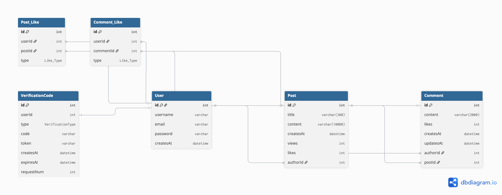

# Forum App
A full-stack forum app with session-based auth, post/comment system, and like functionality.

## Live Demo on 
[forum-client-vercel.app](https://forum-client-22ty.vercel.app/)

## Previews
- Mobile

- Desktop

## Database Design

## Tech Stack
- TypeScript
- Frontend: React, React-Query, Zustand, Tailwind CSS
- Backend: NestJS
- Database: Prisma/MYSQL (Railway), Redis (Railway)
- Auth: Session-based authentication
- Test: jest

## Features
- Secured User registration login
- CRUD posts
- Comment system
- Protected routes for Authenticated User
- Nice Error handling Page

## Testing
- Unit Tests: AuthService, PostService (Jest)

## Highlights
- Built a full-stack application with separate frontend and backend deployment
- Secured session-based authentication and protected user flows
- Implemented session-based auth with Redis store supporting concurrent users on backend
- Designed RESTful APIs with NestJS and Prisma/MySQL
- Optimized data fetching with React-Query and client-side state synchronization
- Indexed createdAt and authorId columns for optimized query performance
- User State managed by Zustand 
- Deployed the frontend on Vercel and integrated backend/database services on Railway
  
## Getting Started
npm install
npm run dev

### Prerequisites
- Node.js 20+
- MySQL
- Redis

## Environment Variables(Examples)
- FRONTEND_URL:"https://forum-client-22ty.vercel.app/"
- SECRET="SECRET"
